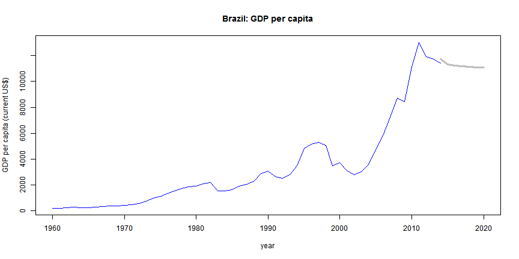

## Summary


. In this project, we use historical data for GDP per capita obtained from the World Bank website (http://databank.worldbank.org/data/reports.aspx?source=world-development-indicators). Using these data, which cover the period from 1960 to 2014, we made the forecast of the period from 2015 to 2020, applying the 'forecast' package available in R software.

. The method was implemented and shared through a Web application, available at https://albertoadami71.shinyapps.io/FORECASTGDP.


--- .class #id 

## Method

We illustrate our method using the data of the Brazilian GDP per capita, expressed in current US$. Thus, we have the following vector 'brazil_gdp':


```
##  [1]   209.1988   203.9552   258.7577   290.0583   259.4670   259.0042
##  [7]   312.8819   344.2945   371.3931   400.2629   440.9931   500.0341
## [13]   580.4885   767.3099   993.2896  1140.9011  1374.5358  1548.3983
## [19]  1723.1372  1885.0911  1923.2826  2106.6790  2199.7020  1551.7730
## [25]  1560.4558  1629.2649  1919.8648  2064.6540  2276.2406  2879.4999
## [31]  3071.6280  2663.7864  2513.6379  2777.3482  3482.5298  4827.3276
## [37]  5163.2658  5279.1505  5083.6265  3476.0808  3738.7194  3136.4967
## [43]  2810.2308  3044.2550  3597.9788  4733.1835  5809.1179  7241.0790
## [49]  8700.6133  8462.3891 11124.0769 13042.1977 11922.7047 11711.0633
## [55] 11384.6181
```


--- .class #id 

In the sequel we apply the exponential smoothing state space model (ets) to calculate the GDP predictions for the next six years (2015-2020).


```r
library(forecast)
tsbr = ts(brazil_gdp)
etsbr =ets(tsbr,model="AAN")
fcast = forecast(etsbr,h=6) 
print(fcast$mean)
```

Time Series:
Start = 56 
End = 61 
Frequency = 1 
[1] 11297.80 11228.32 11172.74 11128.27 11092.70 11064.24

--- .class #id 

Finally, we plot a graphic with historical data (blue) followed by the forecasts (grey). 

 
Conclusion: In this work, we found that the R software, besides being an excellent tool for data analysis, also allows the sharing of Web applications and the preparation of presentation slides.
